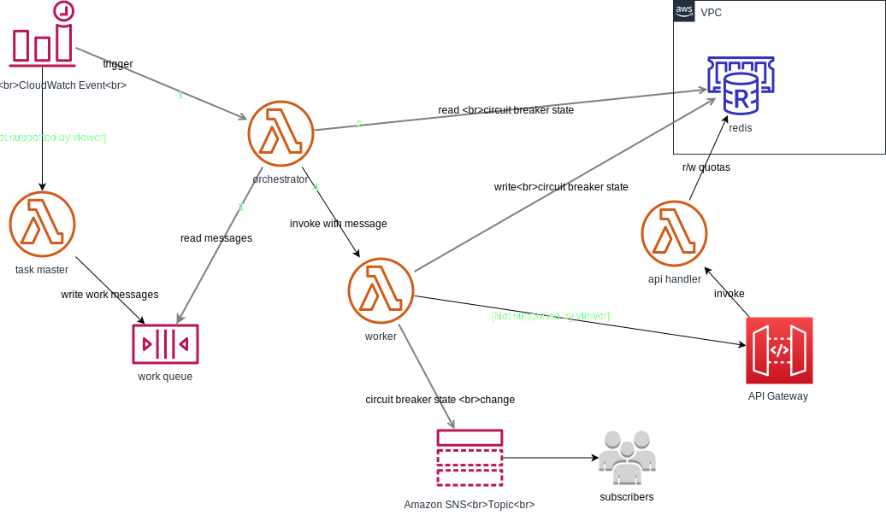

# AWS stack to test throttled external API 
This repo is a sample project used to build and deploy infrastructure and applications to test managing
 queries to an external throttled API.  
 
It uses AWS's [cloud development kit](https://docs.aws.amazon.com/cdk/latest/guide/getting_started.html) 
 (CDK) to deploy the infrastructure and code implementing my test environment.

The services, with underlying infrastructure, will generate a single cloudformation stack, 
as defined in `api_poc/uber_stack.py`.

The lambda functions are in the directory `api_poc/lambda`

## Stack Components
The infrastructure is managed by AWS cloudformation, which the CDK integrates with.  
This application defines all of the infrastructure, including lambda functions. 



### VPC
The dedicated POC environment consists of a VPC with subnets in a single availability zone.
 There are typical VPC components like NAT, internet gateway, route tables.
 All components utilize the private subnets for communication with each other.
 
### API Gateway
The API gateway provides http services for the 'external' API service emulator's lambda function.

### SQS
An SQS queue is used to queue work for the orchestrator to farm out to the workers.

An SQS interface endpoint is defined to allow private communication to SQS.

### SNS
SNS topics and subscriptions are used to publish and consume events of interest.

### Lambda functions

#### Orchestrator
The orchestrator application coordinates the workers in an attempt to manage the 
throttling behavior.  

It is triggered at an interval by a cloudwatch event and first hydrates quota 
state from its quota database (redis). 

If an API is throttled (circuit breaker open) it invokes a worker with a health check
 message to test API operation and update circuit breaker status to closed if quota
 has been lifted. 

If API circuit breaker is closed the function reads work messages from the work queue, 
invoking worker functions to perform work.

#### Worker
The orchestrator invokes this function, sending the work instructions as payload.

There are two types of messages

* Work instructions instruct the function to consume data from the 
external API and perform some work. 
If the API call is throttled, the worker toggles the circuit breaker status 
to open.  
(not implemented as of Sep 17. SNS sounds like a good way to do this - can also
send notifications to slack, etc).

* Health check messages instruct the worker to query the API quota status and effect
a circuit breaker state change from open to closed if quota has been lifted.  

#### Task Master
This function emulates an upstream business process putting work on the work queue
for consumption by the orchestrator.  It is triggered by the same cloudwatch event rule
that triggers the orchestrator function.
 
#### External API server emulator
This service emulates a RESTful API server throttling API calls  
 and is the target for our workers who are performing actual business logic.
 
The API service manages very few resources.

##### Resources
The service tracks surveys used to gather information from people.  
The resource hierarchy is simple.  

* survey: zero or more
  * interview: zero or more
    * attachment: zero or more

The service is read-only from our perspective so the RESTful interface only supports the GET verb.

Resource queries are constructed in typical fashion, specifying the resource hierarchy path with an 
optional resource id at the request terminus.

e.g.
``` 
/survey` return all surveys
/survey/1` return survey with id `1`
...
/survey/1/interview/1/attachment/1 return attachment with id `1` from interview `1` of survey `1`
```

note: the API server doesn't return any pertinent data yet as we're currently only testing throttling.
It returns a small json payload.

Each call to a resource endpoint decrements that resource and its parent(s) in the throttling db.
When a throttle limit is reached it will respond with http status code `429` 
and the response will indicate the resource path location where it hit the throttle limit.

Other useful resources
* `keys` returns the current contents of the quota db. 

### Redis cluster
There is a tiny AWS Elasticache redis cluster hosted in the VPC for tracking
 throttle parameters, counts, etc.  The lambda functions are attached to the VPC
 in order to communicate with the redis cluster. 

## Local development and testing 
We can test locally using the 
[sam cli](https://docs.aws.amazon.com/serverless-application-model/latest/developerguide/what-is-sam.html)

### Setup

#### Clone the repo
```
git clone git@github.com:mfrasier/api-poc.git
cd api-poc
```

#### Python virtual env
This a python3 implementation of the CDK and requires a python3 virtual env.

To manually create a virtualenv on MacOS and Linux:

```
$ python3 -m venv .env
```

After the init process completes and the virtualenv is created, you can use the following
step to activate your virtualenv.

```
$ source .env/bin/activate
```

If you are a Windows platform, you would activate the virtualenv like this:

```
% .env\Scripts\activate.bat
```

Once the virtualenv is activated, you can install the required dependencies.

```
$ pip install -r requirements.txt
```

#### Install AWS SAM CLI

See [Installing the AWS SAM CLI](https://docs.aws.amazon.com/serverless-application-model/latest/developerguide/serverless-sam-cli-install.html)

#### Start a redis server
Starting a redis server, on MacOS using brew in this case - could run one in a docker container

`$ redis-server --protected-mode no`

#### Test files for SAM
Create a file containing sample environment variables for use by sam cli (e.g. `env.json`)
Use the appropriate IP address to reach your local test redis server.

The topmost key(s) must match your lambda resource name(s) from template.yaml.  
The values are the environment variables required by the lambda(s) under test.

```json
{
  "externalapihandler82E49736": {
    "REDIS_ADDRESS": "192.168.1.205",
    "REDIS_PORT": "6379"
  }
}
```
Here is one way to retrieve the `externalapi` lambda resource name
```bash
$ grep -B1 AWS::Lambda::Function template.yaml  | grep externalapi | cut -d':' -f1
  externalapihandler82E49736
``` 
SAM will also helpfully give you a list if you specify the incorrect name.

The below commands will
* generate a cloudformation template for local sam usage
* generate test event data in a file (`apigateway_event.json` in this case) 

```bash
$ cdk synth --no-staging > template.yaml
$ sam local generate-event apigateway aws-proxy > apigateway_event.json
```

In the file `apigateway_event.json`
* Change the `path` attribute to one of the paths supported by the API server.
* Change the `httpMethod` to `GET` as that is the only method supported.

I've set mine to include multiple paths so I can quickly switch between them
by setting the `path` key to the desired value.

In this example, `/survey/1/interview/1/attachment/1` is the path that will be 
read by the API server lambda function (because the value of key `path` is what it reads). 
```json
{
  "body": "eyJ0ZXN0IjoiYm9keSJ9",
  "path": "/survey/1/interview/1/attachment/1",
  "path1": "/survey/1/interview/1",
  "path2": "/survey/1",
  "path3": "/keys",
  "httpMethod": "GET",
...
}
```

#### Test on local stack
Using the above environment and event files as input, and the lambda identifier, 
run lambda locally.
```bash
$ sam local invoke externalapihandler7E50D66D --event ./apigateway_event.json  --env-vars env.json
```

The other lambdas can be tested locally in a similar fashion.

You can also start up API Gateway using SAM local but that's not covered here.

## Stack operations with the AWS CDK
There can be multiple stacks in a CDK app but we have only one.
Some CDK commands require a stack name parameter but that's not required when
there is only one stack.

### AWS credentials and region
I exported the environment variables `AWS_PROFILE` and `AWS_DEFAULT_REGION` to 
determine AWS credentials and region used for all live CDK operations.

e.g.
```bash
$ export AWS_PROFILE=<your_configured_profile>
$ export AWS_DEFAULT_REGION=<your_favorite_region>
``` 

You can specify a role to assume from your profile but that wasn't necessary
in my case and is not shown here.

### Bootstrap CDK resources (staging bucket, etc)
You need to this once per account/region (i think) to set up resources for CDK itself,
such as the S3 bucket it uses for staging lambda assets, etc.
`cdk bootstrap`

### List defined stacks in the app

```bash
$ cdk ls
api-uberstack-dev
```

The stack name(s) there will be the name of your stack when deployed to Cloudformation.

### Synthesize stack
This creates your cloudformation stack template which you can inspect.
 By defaut it is written to stdout but can be redirected into a file when desired.

```bash
$ cdk synth
Resources:
  apipocvpcDC0F60F9:
    Type: AWS::EC2::VPC
    Properties:
      CidrBlock: 10.0.0.0/23
...
```

### Stack diff
This command causes an inspection of your deployed stack with the generated stack and
generates very helpful diff output showing additions, deletions, changes, etc.  

This only shows my deployed and local stacks are in sync and no changes are envisioned.  
```bash
$ cdk diff
Stack api-uberstack-dev
The api-uberstack-dev stack uses assets, which are currently not accounted for in the diff output! See https://github.com/aws/aws-cdk/issues/395
There were no differences
```

The results of the `diff` operation will be very different from the above if 
the stack is not yet deployed.  It will show all the changes necessary to 
deploy the new stack.

This is an example showing required changes where a security group, 
cloudwatch rule, and lambda code were updated locally. 

```bash
$ cdk diff
The api-uberstack-dev stack uses assets, which are currently not accounted for in the diff output! See https://github.com/aws/aws-cdk/issues/395
Security Group Changes
┌───┬─────────────────────────────────────┬─────┬──────────┬─────────────────────────────────────┐
│   │ Group                               │ Dir │ Protocol │ Peer                                │
├───┼─────────────────────────────────────┼─────┼──────────┼─────────────────────────────────────┤
│ + │ ${api_poc-vpc.DefaultSecurityGroup} │ In  │ TCP 6379 │ ${api_poc-vpc.DefaultSecurityGroup} │
└───┴─────────────────────────────────────┴─────┴──────────┴─────────────────────────────────────┘
(NOTE: There may be security-related changes not in this list. See http://bit.ly/cdk-2EhF7Np)

Resources
[+] AWS::EC2::SecurityGroupIngress default_sg/from apiuberstackdevdefaultsg65F5F0FA:6379-6379 defaultsgfromapiuberstackdevdefaultsg65F5F0FA63796379ECAEC424
[~] AWS::Lambda::Function external-api-handler externalapihandler82E49736
 └─ [~] Metadata
     └─ [~] .aws:asset:path:
         ├─ [-] asset.227b28977e5cbf23ce15712e33374fa7f79bcc92404c009c3115bd70082515cb
         └─ [+] asset.2c823498c0fd1e30130860ca4ac5337071caf601d16634d83bb03e426a2c313e
[~] AWS::Lambda::Function orchestrator-handler orchestratorhandler84D948A3
 └─ [~] Metadata
     └─ [~] .aws:asset:path:
         ├─ [-] asset.227b28977e5cbf23ce15712e33374fa7f79bcc92404c009c3115bd70082515cb
         └─ [+] asset.2c823498c0fd1e30130860ca4ac5337071caf601d16634d83bb03e426a2c313e
[~] AWS::Events::Rule orchestrator_rule orchestratorruleC0505227
 └─ [~] ScheduleExpression
     ├─ [-] cron(0/5 * ? * MON-FRI *)
     └─ [+] cron(0/10 * ? * * *)
```

### Deploy the stack
This command attempts to modify your deployed stack to conform to your defined stack.
It will show creation of a cloudformation changeset and cloudformation events
as resources are created or modified.

For production stacks it is recommended to populate the stack env with account and region
so it is only deployed where you define.  To make this repo public, and in order
to deploy to any account as non-production I left that information out.
 
```bash
$ cdk deploy
Do you wish to deploy these changes (y/n)? y
api-uberstack-dev: deploying...
api-uberstack-dev: creating CloudFormation changeset...
...
``` 

### Destroy the stack
This deletes your deployed stack.

`cdk destroy`

## Test deployed stack

### Invoke deployed API handler lambda directly
This invokes the deployed lambda directly, without the API Gateway intermediary.  
Useful for troubleshooting gateway errors - status code 502, etc - 
to more directly view the likely lambda issue. 

Using the appropriate function name parameter for your environment: invocation with curl.

```bash
$ aws lambda invoke \
  --region us-east-1 \
  --function-name api-poc-dev-ExternalApiHandler7E50D66D-LDEJZM1WSHCB \
  --payload file://apigateway_event.json \
  --log Tail \
  lambda.out
```
The log is base64-encoded in case you need to view it.

Output returned from lambda is in file `lambda.out` 

The other lambdas can be tested in a similar fashion.

### External api server
Call the api handler lambda via the API Gateway endpoint to emulate an external API server.

The api gateway URL is a cloudformation output which CDK will print when its successful.
It can also be retrieved using aws cli 
```bash
$ aws cloudformation describe-stacks --stack-name api-uberstack-dev \
  --query 'Stacks[0].Outputs' --output text | grep externalapi
```
or using the console. 

See above for valid resource or admin paths to append.

A couple of examples:

```bash
$ curl -XGET https://e3ryyap5mf.execute-api.us-east-1.amazonaws.com/prod/survey/1/interview/1/attachment/1

{"data": {"data": "something"}, "quota": 5, "status_code": 200, "message": ["Hello, CDK!  You have hit /survey/1/interview/1/attachment/1\n"]}
```

```bash
$ curl -XGET https://e3ryyap5mf.execute-api.us-east-1.amazonaws.com/prod/keys

{"keys": [{"name": "survey:interview:attachment:none", "value": "4", "ttl": 57}, {"name": "survey:interview:none", "value": "9", "ttl": 57}, {"name": "survey:none", "value": "19", "ttl": 57}]}
```
